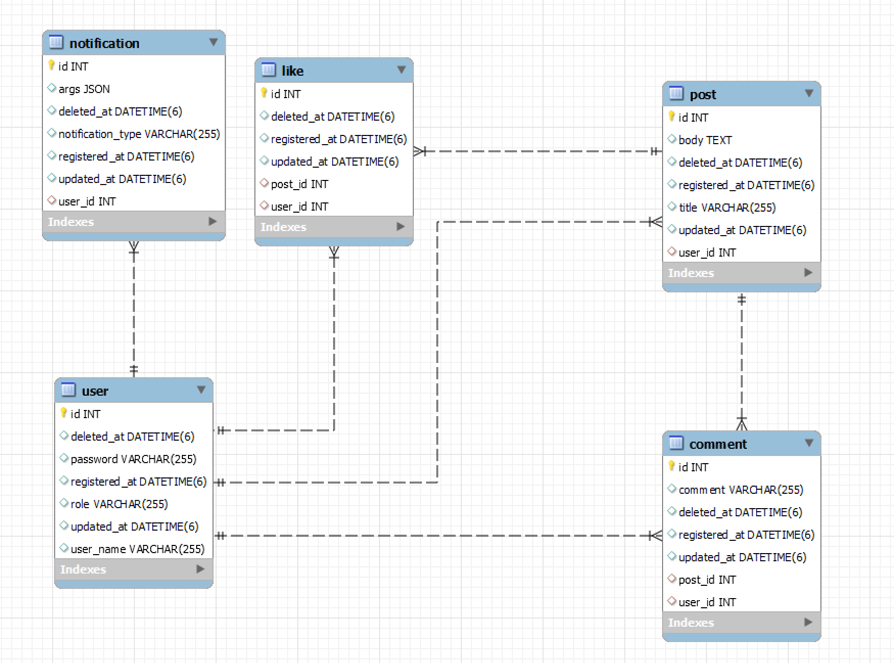

# Simple SNS Service

This project is for users to create / view posts

## Features

- User can create posts and comments
- User can hit a like button on posts
- User can get notifications if someone else likes the user's posts
- The service is integrated with Spring Security, that uses can use JWT tokens to access the service
- The service is integrated with Redis, for caching in memory to reduce the number of DB accesses 

## Tech Stack

- Spring Boot
- Gradle
- Spring Data JPA
- Lombok
- MySQL
- Spring Security
- JWT
- Redis
- JUnit

## Entity Relationship Diagram

## Lessons Learned

- Polling
  - Client sends scheduled request and server sends response
  - Unnecessary API calls can happen if there's no updated data
  - Cannot receive response as a real-time update
- Long-Polling
  - Client sends request and server sends response if there is updated data as a real-time update
  - Improved from Polling, However, if data is updated very often, there is not so much difference from Polling
- SSE (Server-Sent Event) 
  - Client can subscribe a specific event
  - If event occurs in the server, the server sends a response to the client
  - This is uni-directional, server to client
- WebSocket
  - Enables bidirectional communication between the server and the client
- Issue with JPA's default method
    - When soft-deleting data, if we use the default JPA method, then JPA bring the data to the persistence context first, and delete the data
    - So, JPA makes 2 DB calls to delete data (SELECT and then DELETE)
    - In this case, it is better to use native query to mark data as deleted in one query
- Redis
  - helps cache data in memory, and multiple instances can share data by using Redis
  - Slower than local caching, because Redis is connected over network
